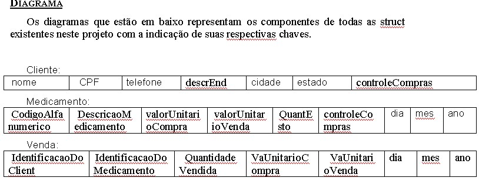

# Nome do produto
> Descrição curta sobre o que seu projeto faz.

Projeto final de Lab 2 implementado em C ANSI II

Projeto Final: CONTROLE DE UMA REDE DE FARMÁCIAS

Aluno: Fernando Henrique Antero   – UC15100312

Esse programa é usado para fazer um controle em uma rede de farmácia. O programa irá cadastrar clientes, pedindo o CPF, o nome completo, endereço, cidade, estado e telefone, poderá também fazer alteração no cliente, excluir cliente ou até mesmo pesquisando pelo nome. Ele também vai fazer cadastro de um medicamento, pedindo o código alfanumérico, a descrição do medicamento, a data de validade, valor da compra, valor da venda e a quantidade em estoque, podendo alterar ou excluir o medicamento, ou pesquisa pelo nome, em outra função poderá fazer a realização de venda, cadastrando uma venda ou excluindo, quando for cadastra uma venda, será pedido o CPF do cliente, código do medicamento, valor da compra é do próprio cadastro do medicamento, valor de venda e a quantidade vendida, sendo salvo também a data da venda, fazendo as devidas alteração no estoque quando for comprado ou excluído. Quando o cliente realiza uma venda, ele não poderá ser excluído, a menos que a venda seja excluída, e isso também vale para o medicamento, se ele for comprado não poderá ser excluído, e também não vai poder fazer uma venda se o produto estiver vencido.

## Instalação
Instalar a IDE http://www.bloodshed.net ou a que mais gostar de utilizar.
http://www.bloodshed.net/Dev-Cpp-4.0

## Exemplo de uso
Na pasta Menu_C_Template contém um template de um menu renderizado usando C com as devidas funções, caso queira extrair para utilizar em outros projetos.

## Descrição

É aqui estão as estruturas usadas no projeto para desenvolver o programa de controle de uma rede de farmácia.
Primeira estrutura é para os clientes:
typedef struct
{
  	char nome[50];
  	char CPF[13];
  	char telefone[13];
  	char descrEnd[34];
  	char cidade[34];
  	char estado[4];
  	int controleCompras;
}Cliente;
	Usando essa estrutura para o cadastro de cliente, fazendo as manipulações necessárias para a alteração ou a exclusão do cliente (nome, CPF, telefone, endereço, cidade, estado e o controle de compras).
Segunda estrutura usada no programa:
typedef struct
{
  char DescricaoMedicamento[50],CodigoAlfanumerico[11];
  float valorUnitarioCompra,valorUnitarioVenda;
  int QuantEsto,dia,mes,ano;
  int controleCompras;
  
}Medicamento;
Usando essa estrutura para o cadastro de medicamento, fazendo as manipulações necessárias para a alteração ou a exclusão do medicamento (Código Alfanumérico, Descrição do Medicamento, valor Unitário da Compra, valor Unitário da Venda, Quantidade em Estoque, dia, mês, ano sendo a data de vencimento e o controle).
Terceira estrutura usada no programa:
typedef struct
{
  	char IdentificacaoDoClient[13];
  	char IdentificacaoDoMedicamento[11];
  	int QuantidadeVendida;
  	float VaUnitarioCompra,VaUnitarioVenda;
  	int dia,mes,ano;
}Venda;

Usando essa estrutura para o cadastro de venda, fazendo as manipulações necessárias para a exclusão de uma venda (Identificação Do Cliente, Identificação Do Medicamento, Quantidade Vendida, Valor Unitário de Compra, Valor Unitário de Venda e o dia, mês, ano sendo a data da realização da venda).

## Telas

## Agradecimentos e Conclusão

-Agradeço ao Professor Jair Alves Barbosa por ter me ensinado algoritmos e programação estruturada em C da forma mais correta, ajudando a corrigir todos vícios de programação.Com o desenvolvimento desse projeto proposto pelo professor Diego, fui capaz de aprimorar meus conhecimento em C, referente ao tema de arquivos, pois tive que colocar estruturas lá dentro, fazendo com que elas fossem alteradas de acordo com o usuário e também fazendo com que excluísse alguma estrutura.

